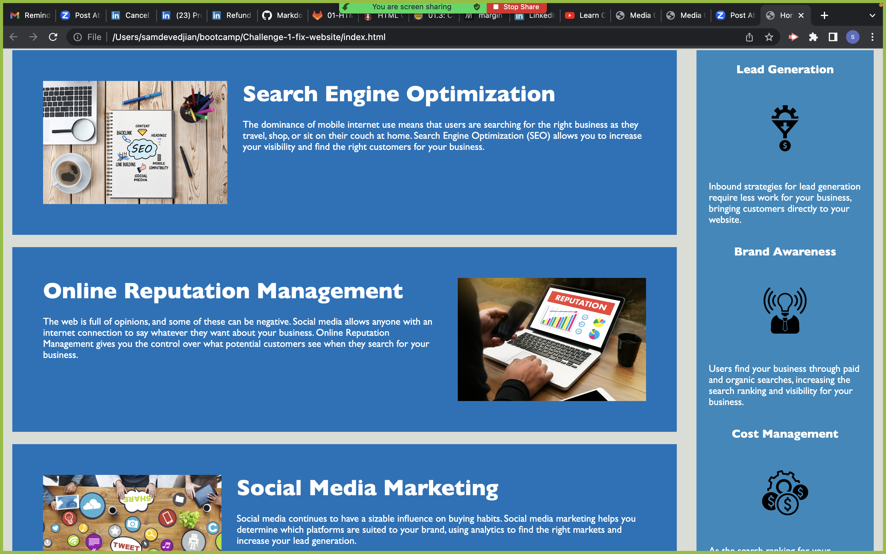

# <New_And_Improved_Horizon_Website">

## Description

A big motivation for this project was to improve the functionality of the code, cleaning up the structure, and making sure it followed all web accessibility standards. One way this was accomplished was by adding semantic elements. Semantic elements help define the meaning of the given content while improving the structure of the HTML and by making it easier to read. A big portion of this project was to make sure the web page was user-friendly. Web accessibility is important because it ensures that people with disabilities who are using assistive technology can access a website. I did this by adding alt attributes to the img tags. The alt attribute provides alternative information for an image. For example, if an image file cannot load an Alt text will be displayed. Alt attributes also enable screen readers to read the information about the image. 


## Usage

Provide instructions and examples for use. Include screenshots as needed.

To add a screenshot, create an `assets/images` folder in your repository and upload your screenshot to it. Then, using the relative filepath, add it to your README using the following syntax:

    The following image's demonstrates the web application's appearance:

    ![The screenshots provided display the Horizon website] (./assets/images/screenshot1.png)

    

    

    ```


